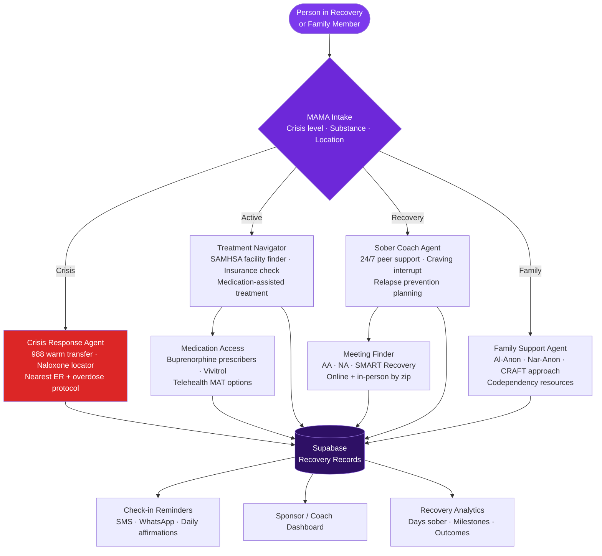

<p align="center">
  <h1 align="center">mama-addiction-recovery</h1>
  <h3 align="center"><em>SAMHSA-connected recovery tools — crisis response, sober coaching, treatment navigation.</em></h3>
</p>

<p align="center">
  <a href="LICENSE"></a>
  
  
  <a href="https://mama.oliwoods.ai"></a>
  <a href="https://mama.oliwoods.ai/foundation"></a>
</p>

---

> *"Drug overdose deaths topped 107,000 in 2023. Only 1 in 10 people with a substance use disorder receive any treatment. The treatment gap is not a funding problem — it's a navigation problem."*
> — **CDC National Center for Health Statistics, 2023** | The average time from first substance use to first treatment is 11 years.

---

## Why This Exists

The treatment system for substance use disorders is fragmented, stigmatized, and inaccessible at the moment people most need it. People in crisis can't navigate insurance, waitlists, and intake paperwork.

- **107,000+ people** died from drug overdoses in 2023 — CDC NCHS 2023
- **Only 1 in 10** people with substance use disorder receives any form of treatment — SAMHSA NSDUH 2022
- **Average wait time** for residential treatment is 2–4 weeks; overdose risk peaks in the first 48 hours of a relapse — NIDA 2023
- **Medications for OUD** (buprenorphine, naltrexone) reduce mortality by 50% but only 18% of patients receive them — SAMHSA 2022
- Naloxone can reverse opioid overdose in minutes — **but 80% of overdoses happen without it nearby** — Harm Reduction International 2023

**We built this because the window between crisis and catastrophe is measured in hours, not weeks.**

---

## System Architecture



---

## Features

| Agent | What It Does | Data Sources |
|---|---|---|
| **Crisis Response** | Immediate 988 warm transfer, naloxone locator, nearest ER + overdose protocol | 988 Lifeline, NEXT Distro, SAMHSA |
| **Treatment Navigator** | SAMHSA facility finder with real-time bed availability, insurance verification | SAMHSA ATF, NAATP, BHSIS |
| **Sober Coach** | 24/7 peer support, craving interrupt conversations, relapse prevention planning | SMART Recovery, motivational interviewing frameworks |
| **Medication Access** | Finds buprenorphine prescribers, Vivitrol programs, telehealth MAT options | SAMHSA Buprenorphine Practitioner Locator |
| **Meeting Finder** | AA, NA, SMART Recovery by zip code — in-person and online | AA, NA, SMART Recovery meeting APIs |
| **Family Support** | Al-Anon, Nar-Anon, CRAFT approach resources, codependency education | CRAFT research (Meyers & Wolfe), Al-Anon/Nar-Anon |

### Platform Capabilities
- **24/7 Crisis Escalation** — automatic warm transfer to 988 Suicide and Crisis Lifeline (press 2 for substance use)
- **Naloxone Locator** — finds the nearest naloxone distribution point in real time
- **Daily Check-ins** — SMS/WhatsApp sobriety milestones and relapse prevention prompts
- **Offline-First** — core crisis functions work without internet
- **Privacy-First** — substance use history never shared; HIPAA-aware data handling

---

## Quick Start

```bash
git clone https://github.com/OliWoods-Org/mama-addiction-recovery.git
cd mama-addiction-recovery
npm install
npm run dev
```

## Tech Stack

- **Runtime:** Node.js + TypeScript
- **Validation:** Zod schemas
- **Database:** Supabase (PostgreSQL)
- **AI:** Claude API / local LLM (sober coaching, motivational interviewing)
- **Alerts:** Twilio (SMS/WhatsApp), Resend (email)
- **Crisis:** 988 API, SAMHSA ATF real-time facility data

---

## Research & Citations

- CDC National Center for Health Statistics. (2023). *Drug Overdose Deaths in the United States, 2023*.
- SAMHSA. (2022). *National Survey on Drug Use and Health (NSDUH)*.
- National Institute on Drug Abuse. (2023). *Drugs, Brains, and Behavior: The Science of Addiction*. nida.nih.gov
- SAMHSA. (2022). *Medications for Substance Use Disorders*.
- Harm Reduction International. (2023). *Global State of Harm Reduction Report*.
- Meyers, R.J. & Wolfe, B.L. (2004). *Get Your Loved One Sober: Alternatives to Nagging, Pleading, and Threatening*. (CRAFT framework)

---

## Contributing

We welcome contributions. This is open source because we believe in community-driven solutions.

1. Fork the repo
2. Create a feature branch (`git checkout -b feat/your-feature`)
3. Commit your changes
4. Push and open a PR

## License

AGPL-3.0 — Free to use, modify, and distribute.

---

<p align="center">
  <strong>Built by the <a href="https://oliwoods.ai">OliWoods Foundation</a></strong><br>
  <em>Free forever. Open source. Because recovery is possible — and no one should navigate it alone.</em>
</p>
